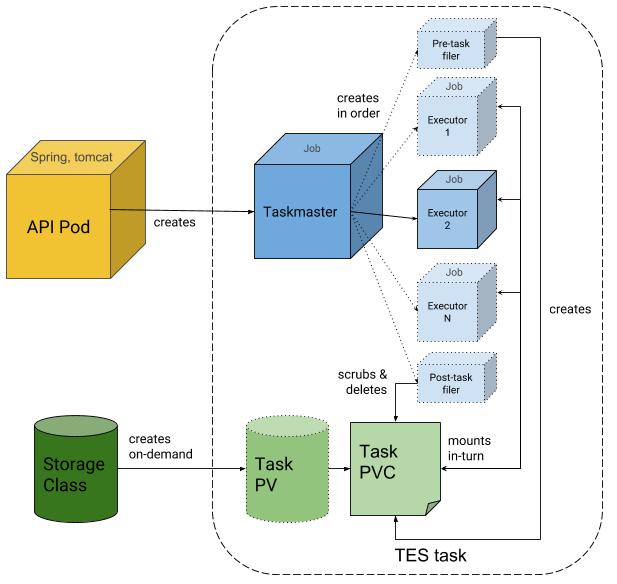

An implementation of a task execution engine based on the [TES standard](https://github.com/ga4gh/task-execution-schemas) running on `Kubernetes`. For more details on `TES`, see the (very) brief [introduction to TES](documentation/tesintro.md).

For organisational reasons, this project is split into 3 repositories:
- This one, which contains documentation and deployment files
- [tesk-api](https://github.com/EMBL-EBI-TSI/tesk-api): Contains the service that implements the TES API and translates tasks into kubernetes batch calls
- [tesk-core](https://github.com/EMBL-EBI-TSI/tesk-core):  Contains the code that is launched as images into the kubernetes cluster by tesk-api.

If the API is running on your cluster it will pull the images from our `gcr.io` repository automatically.

`TESK` is designed with the goal to support any `Kubernetes` cluster, for its deployment please refer to the [deployment](documentation/deployment.md) page, the instructions provided there can be used in heterogeneous environments, with minimal configuration.

We are also providing some specific instructions for setting up and exposing the `TESK` service using:

-   RedHat [OpenShift](documentation/openshift_setup.md)
-   On-Premises VMs in [OpenStack](documentation/ingress.md)

The technical documentation is available in the [documentation](documentation) folder.

## Architecture
As a diagram:

**Description**: The main work is performed by 2 pods. First is the API pod, a pod which runs a web server (`Tomcat`) and exposes the `TES` specified endpoints. It consumes `TES` requests, validates them and translates them to `Kubernetes` jobs. The API pod then creates a `task controller` pod, or `taskmaster`. The `taskmaster` consumes the executor jobs, inputs and outputs. It first creates `filer` pod, which creates a persistent volume claim (PVC) to mount as scratch space. All mounts are initialized and all files are downloaded into the locations specified in the TES request; the populated PVC can then be used by each executor pod one after the other. After the `filer` has finished, the taskmaster goes through the executors and executes them as pods one by one. After the last executor, the `filer` is called once more to process the outputs and push them to remote locations from the PVC. The PVC is the scrubbed, deleted and the taskmaster ends, completing the task.

## Requirements
-   A working [Kubernetes](https://kubernetes.io/) cluster version 1.8 and later.
