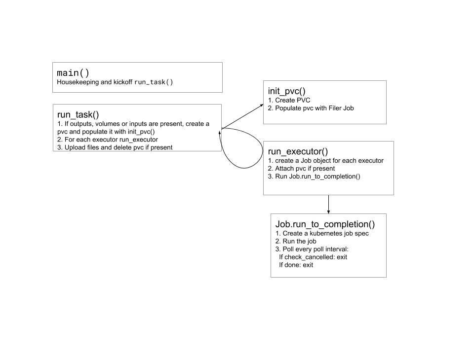

# taskmaster architecture

The core flow of the taskmaster is creating a series of Job objects (representation of Kubernetes job) that are run, and polled until they are done. Architecture flow starting from main:

For more details see source comments.
